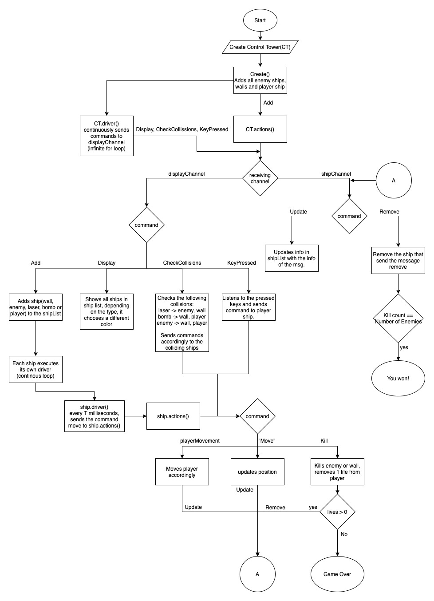

# Space Invaders Architecture
There are 3 main structures used in this program that work together.
The ship structure that contains the information of every object in game. Depending on the type is the color and size it will have. 
the "in" property is what allows the communication between the control tower and the ships.
```
type ship struct {
	sType  string
	name   string
	x      float64
	y      float64
	alive  bool
	vx     float64
	vy     float64
	in     chan msg
}
```
The controlTower structure, as its name says, its the one that controls everthing that happens and its the one in charge of sending the commands to the ships so they know what to do. 
shipList contains the list of all ships in the game (player, enemies, walls, player and enemies' bullets)
shipChan is the channel that receives the commands from the ships to update or remove them.
displayChan is the one in charge of manageing the collisions, the keystrokes from the player and the display of the ships.
commandChan maps the "in" channel of the ships to their names so when a command is sent to commandChan it is sent to the ship as well.
```
type controlTower struct {
	shipList        map[string]ship
	shipChan	    chan msg
	displayChan     chan msg
	commandChan     map[string](*chan msg)
}
```
Lastly, the msg structure is the structure that contains the information of the commands.
cmd contains what its going to happen (Add, Kill, Remove, Update, checkCollisions, display, keyPressed, Move, etc...)
val contains the type of ship that is going to be created.
s contains the ship itself, so that it can send information about itself in the message.

```
type msg struct {
	cmd string
	val string
	s   ship
}
```

Both the control tower and the ships have 2 main functions. driver() and actions().

The driver function is the one in charge of sending commands to the channels so that every tick of time they do something.
Also the control tower driver creates all objects with the create() function.

```
func (m *controlTower) driver() {
	create()
	atomicGo(ct.actions)
	var a = 0
	for range time.NewTicker(time.Duration(shipSpeed) * time.Millisecond).C {
		a = a + 1
		if a%2 == 0 {
			ct.displayChan <- msg{cmd: "Display"}
		}
		if a%2 == 0 {
			ct.displayChan <- msg{cmd: "CheckCollisions"}
		}
		if a%2 == 0 {
			ct.displayChan <- msg{cmd: "KeyPressed"}
		}
	}
}
```
the actions function is the one in charge of receiving the message with a command and do different things depending on the command received.
```
func (m *controlTower) actions() {
	for {
		select {   
		case message := <-m.shipChan:
			if message.cmd == "Update" {
				m.shipList[message.s.name] = ship{name: message.s.name,
													sType: message.s.sType,
													x: message.s.x, 
													y: message.s.y, 
													alive: message.s.alive}
			} else if message.cmd == "Remove" {

				delete(m.shipList, message.s.name)
				if(message.s.sType == "Enemy"){
					enemyKC++
					if enemyKC > numEnemies{
						finish = true
					}
				}
			}
		case message := <-m.displayChan:
			if message.cmd == "Add" {
				name := message.val
				if name != "Ship" {
					// add timestamp to differentiate from others
					name = fmt.Sprintf(message.val, time.Now())
				}
				p := ship{name: name, 
						  sType: message.val, 
						  x: message.s.x, 
						  y: message.s.y, 
						  alive: true, 
						  vx: message.s.vx, 
						  vy: message.s.vy, 
						  in: make(chan msg)}
				m.commandChan[p.name] = &p.in
				atomicGo(p.driver)
			}
```

Lastly, here is the diagram that explains the flow of the whole program;
